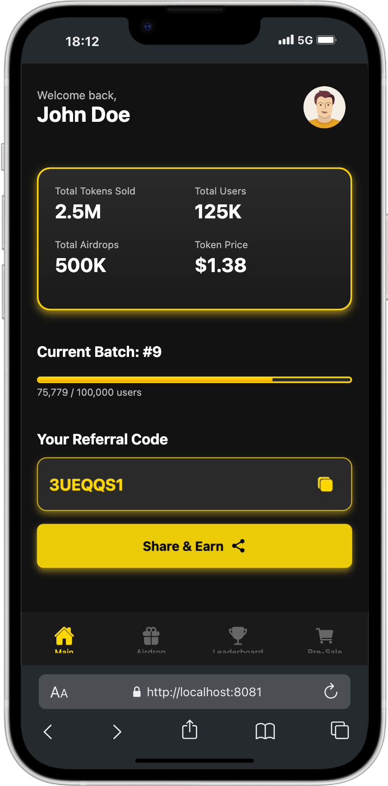

# GramXRO ICO/Airdrop Dashboard App

## 🚀 Overview
GramXRO is a cutting-edge ICO and Airdrop dashboard application designed for managing token sales, airdrop distributions, and referral-based rewards. The app provides real-time updates, batch sale progressions, a leaderboard, and an interactive user experience.

## 📸 App Screenshots

<p align="center">
  
  
</p>

<p align="center">
  
  
</p>


## 📌 Features
### **1. User Dashboard**
- Personalized greeting with profile icon
- Key metrics:
  - Total Tokens Sold
  - Total Users Registered
  - Total Airdrops Distributed
  - Token Listing Price
- **Leaderboard Access** for tracking top referral users
- **Bottom Navigation Menu** for easy access to:
  - Home
  - Airdrop Section
  - Leaderboard
  - Pre-Sale Token Purchase
- **Dark Theme UI** with yellow highlights and real-time data updates

### **2. ICO/Airdrop Batch Sale**
- Displays **Current Batch Details**:
  - Batch Number
  - Price Per Share
  - Total Supply in Batch
  - Number of Participants
- **Batch Progression System**:
  - Progress bar visualization
  - Auto-transition to the next batch
- **Next Batch Preview**
- **Call-to-Action Button** to encourage engagement

### **3. User Account & Balance**
- **FlyXPay Branding**
- **Token & Listing Price Metrics**
  - Total Coins Owned
  - Listing Price per Coin
  - Referral Statistics
- **Withdrawal System** with eligibility checks (KYC, minimum balance, etc.)
- **Referral Code System** with copy and share functionality

### **4. Batch System Mechanics**
- Batch progression structure
- Each batch has a set number of users and tokens allocated
- Auto-transition of users when batches are full
- Dynamic UI updates when batches change

### **5. Leaderboard System**
- **Top 3 Users Highlighted** with gold, silver, and bronze icons
- Displays:
  - Username
  - Total Shares
  - Total Earned Coins
- **Backend Integration for real-time ranking updates**
- **Admin Panel for managing leaderboard and rewards**

### **6. Earn More Coins System**
- Social engagement tasks (Telegram, Instagram, YouTube) with coin rewards
- **Referral Program**:
  - Earn additional tokens by inviting users
  - Milestone-based referral rewards
- **Floating Share & Earn Menu**

### **7. Referral Program & Rewards**
- Users get a **scratch card** after 10 successful referrals
- Rewards include:
  - FlyX Coins
  - Smartphones
  - Smartwatches
- **Progress Bar Visualization** for tracking referrals

## 🛠️ Tech Stack
- **Frontend:** React Native (Expo) with NativeWind for styling
- **Backend:** Node.js, Express.js
- **Database:** Firebase / MongoDB (for real-time updates)
- **Authentication:** Firebase Auth / JWT
- **State Management:** Redux Toolkit / React Context API
- **Deployment:** AWS EC2, Vercel, Firebase Hosting

## 🔧 Installation & Setup
1. Clone the repository:
   ```sh
   git clone https://github.com/yourusername/GramXRO-ICO-Dashboard.git
   cd GramXRO-ICO-Dashboard
   ```
2. Install dependencies:
   ```sh
   npm install
   ```
3. Run the application:
   ```sh
   npm run dev
   ```

## 🚀 Deployment
- **Expo:**
  ```sh
  expo start
  ```
- **Firebase Hosting:**
  ```sh
  firebase deploy
  ```
- **AWS EC2 Setup:**
  ```sh
  ssh user@your-server-ip
  git pull origin main
  pm2 restart app
  ```

## 📌 Admin Panel Features
- Modify batch settings (coin value, user limits, etc.)
- Pause or reset batch sales
- Manage referral and leaderboard rewards
- Track user activity and prevent fraudulent referrals

## 📢 Contributing
We welcome contributions! Feel free to open issues and submit pull requests.

## 📜 License
This project is licensed under the MIT License.

---

🔥 **Join our community & stay updated:**
- Telegram: [Join Now](https://t.me/GramXRO)
- Twitter: [Follow Us](https://twitter.com/GramXRO)
- Website: [Visit Here](https://www.gramxro.com)

